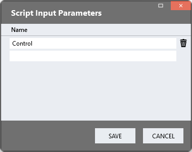
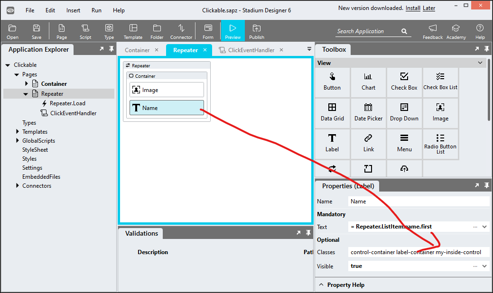
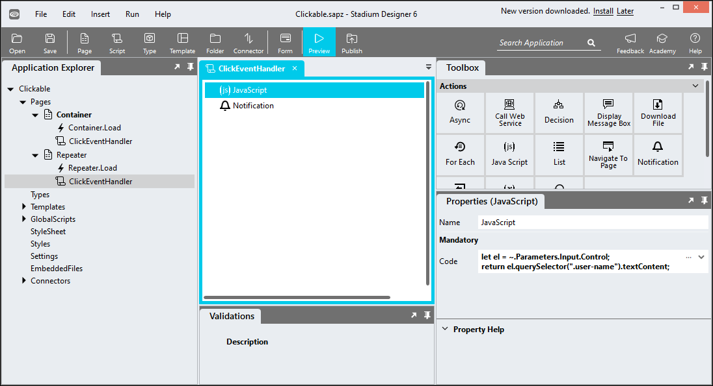
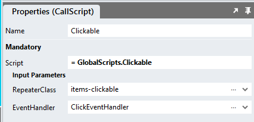

# Clickable

Sometimes we may want to allow users to click on container controls that contain multiple other controls, but are not clickable out-of-the-box. 

## Description
The script below allows you to make any container control clickable. When clicked, it passes the clicked control to a callback script. Below is [an example](#page-setup) that show how to extract information from child elements of the clickable container. This method can be applied to any non-clickable control, like a Label, for example. 

Use this method when you want to display collections of display controls (like Labels and Images) and want to make the entire container clickable or when you want to make a non-clickable control clickable. Do not apply this method with container controls that contain clickable elements, such as Links, Buttons, TextBoxes, DropDowns or other form elements. 

https://github.com/stadium-software/clickable/assets/2085324/85257f7a-f0d5-4b68-9706-3ba7fc0190b8

## Version
1.0 initial release

# Setup

## Application Setup
1. Check the Enable Style Sheet checkbox in the application properties

## Global Script Setup
1. Create a Global Script called "Clickable"
2. Add the following input parameters to the Global Script
   1. EventHandler
   2. RepeaterClass
3. Drag a JavaScript action into the script
4. Add the Javascript below into the JavaScript code property
```javascript
/* Stadium Script V1.0 */
let scope = this;
let parent = document.querySelector("#app > .container");
let eventHandlerScript = ~.Parameters.Input.EventHandler;
let clicked = (e) => {
    observer.disconnect();
    if (e.target.classList.contains("stadium-clickable")) {
        scope[eventHandlerScript](e.target);
    } else { 
        scope[eventHandlerScript](e.target.closest(".stadium-clickable"));
    }
    observer.observe(parent, options);
};
let initClickable = () => {
    observer.disconnect();
    let clickable = parent.querySelectorAll(".stadium-clickable");
    for (let i = 0; i < clickable.length; i++) { 
        clickable[i].removeEventListener("click", clicked);
        clickable[i].addEventListener("click", clicked);
        clickable[i].style.cursor = "pointer";
    }
    observer.observe(parent, options);
 };
let options = {
        childList: true,
        subtree: true,
    },
    observer = new MutationObserver(initClickable);
initClickable();
```

## Page Setup
1. Drag a container control to the page (e.g. a *Container*)
2. Add a class called "stadium-clickable" to the control
3. Drag other controls into the *Container* control

## Event Handler Setup
1. Create a script under the page (call it anything you like e.g. "ClickEventHandler")
2. Add an input parameter to the script and call it "Control"



3. Add a class of your choosing to a control inside the clickable control (e.g. my-inside-control)



4. Inside the Event Handler, use a Javascript action to extract content from the clicked control by interrogating the "Control" parameter
5. An example of how to interrogate a label control being passed into the clickable control as a child
```javascript
let el = ~.Parameters.Input.Control;
return el.querySelector(".my-inside-control").textContent;
```



## Page.Load Setup
1. Drag the Global Script called "Clickable" into the Page.Load event handler
2. Provide values for the script parameters
   1. EventHandler: The name of the page-level script where you will handle the click event (e.g. "ClickEventHandler")
   2. RepeaterClass (only necessary when the clickable container control is inside a repeater control): Assign a unique classname to the repeater control and supply it as the parameter here


