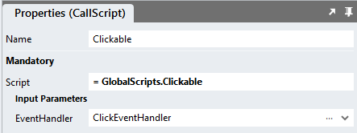

# Clickable

Sometimes we may want to allow users to click on container controls that contain multiple other controls, but are not clickable out-of-the-box. 

## Description
The script below allows you to make controls clickable. It passes a clicked controls to a callback script where the control can be interrogated. Below is [an example](#page-setup) that shows how to extract information from child elements of the clickable container. 

This method can be applied to all non-clickable controls, like Containers, Panels or Labels, for example. This module is useful when you have collections of controls, like some Labels and Images inside a Container control for example, and you want to make the container clickable. 

Do not apply this method with container controls that contain elements that are themselves clickable, like TextBoxes, DropDowns, UploadFile, RadoiButtonList, DropDown or other form elements. 

https://github.com/stadium-software/clickable/assets/2085324/85257f7a-f0d5-4b68-9706-3ba7fc0190b8

## Version
1.0 initial release

# Setup

## Application Setup
1. Check the Enable Style Sheet checkbox in the application properties

## Global Script Setup
1. Create a Global Script called "Clickable"
2. Add the following input parameters to the Global Script
   1. EventHandler
3. Drag a JavaScript action into the script
4. Add the Javascript below into the JavaScript code property
```javascript
/* Stadium Script V1.0 */
let scope = this;
let parent = document.querySelector("#app > .container");
let eventHandlerScript = ~.Parameters.Input.EventHandler;
let clicked = (e) => {
    observer.disconnect();
    if (e.target.classList.contains("stadium-clickable")) {
        scope[eventHandlerScript](e.target);
    } else { 
        scope[eventHandlerScript](e.target.closest(".stadium-clickable"));
    }
    observer.observe(parent, options);
};
let initClickable = () => {
    observer.disconnect();
    let clickable = parent.querySelectorAll(".stadium-clickable");
    for (let i = 0; i < clickable.length; i++) { 
        clickable[i].removeEventListener("click", clicked);
        clickable[i].addEventListener("click", clicked);
        clickable[i].style.cursor = "pointer";
    }
    observer.observe(parent, options);
 };
let options = {
        childList: true,
        subtree: true,
    },
    observer = new MutationObserver(initClickable);
initClickable();
```

## Page Setup
1. Drag a container control to the page (e.g. a *Container*)
2. Add a class called "stadium-clickable" to the control
3. Drag other controls into the *Container* control

## Event Handler Setup
1. Create a script under the page (call it anything you like e.g. "ClickEventHandler")
2. Add an input parameter to the script and call it "Control"


3. Add a class of your choosing to a control inside the clickable control (e.g. my-inside-control)


4. Inside the Event Handler, use a Javascript action to extract content from the clicked control by interrogating the "Control" parameter
```javascript
let el = ~.Parameters.Input.Control;
return el.querySelector(".my-inside-control").textContent;
```

Learn how to interrogate HTML elements: [Finding HTML Elements by CSS Selectors](https://www.w3schools.com/js/js_htmldom_elements.asp)


5. Now use the return value from the Javascript action (e.g. show it in a Notification, navigate to another page and use it as a parameter, save it to the database, etc. )

## Page.Load Setup
1. Drag the Global Script called "Clickable" into the Page.Load event handler
2. Provide a value for the script parameter
   1. EventHandler: The name of the page-level script where you will handle the click event (e.g. "ClickEventHandler")


